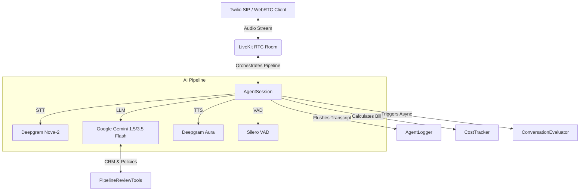

# SignalOps: B2B Revenue Intelligence Voice AI Agent

SignalOps is a production-grade, low-latency Voice AI Agent designed for enterprise B2B sales teams. Built on **LiveKit Agents**, **Google Gemini**, and **Deepgram**, the agent conducts short (3-5 minute) automated pipeline review interviews with sales representatives. Its goal is to reconstruct the true status of sales opportunities, extract critical blockers, identify internal/external dependencies, and log structured insights directly into the CRM.

---

## 🏗️ Architecture Overview

The system is modularly designed across four core layers:



1. **Voice AI Pipeline (`agent/`)**:
   - **STT (Speech-to-Text)**: Deepgram Nova-2 (phonecall model) optimized for telephonic audio.
   - **LLM (Reasoning & Tooling)**: Google Gemini 1.5/3.5 Flash via `livekit.plugins.google`.
   - **TTS (Text-to-Speech)**: Deepgram Aura (low-latency, zero OpenAI dependency).
   - **VAD (Voice Activity Detection)**: Silero VAD for handling natural interruptions and conversational pacing.
   - **System Prompt Guidelines**: Enforces a professional, neutral, non-coaching posture.

2. **Integration Tools (`agent/tools.py`)**:
   - Automatically fetches sales representative context and deal stage taxonomy.
   - Retrieves CRM-specific variables (e.g., deal age, closed-date shifts, stakeholder maps, and last interaction summaries).
   - Interacts with internal dependency trackers (e.g., Solutions Engineering, Security Reviews).
   - Writes verified facts (`append_call_fact`) and call outcomes (`save_call_summary`) back to the database.

3. **Telemetry & Auditing (`monitoring/`)**:
   - **Structured Logger**: Writes JSONL records of all sessions, function calls, and transcripts.
   - **Real-time Cost Tracker**: Aggregates token usage, audio duration, and signaling costs per session and alerts on budget overruns.

4. **Async QA Judge (`evaluation/`)**:
   - Post-call, runs an asynchronous LLM-as-a-judge pipeline to score the call across quality, task completion, relevance, tone, and conciseness, flagging calls that need human review.

---

## 📂 Project Directory Structure

```text
SignalOps/
├── agent/
│   ├── prompts.py             # System prompts, guardrails, and mock taxonomies
│   ├── tools.py               # LiveKit Toolset for fetching deal contexts and logging facts
│   └── voice_agent.py         # Main LiveKit session runner and event handlers
├── config/
│   └── settings.py            # Configuration loader for environment settings
├── evaluation/
│   └── evaluator.py           # LLM-as-a-judge call quality scoring and sentiment analysis
├── monitoring/
│   ├── cost_tracker.py        # Real-time token/minutes/infrastructure cost billing
│   └── logger.py              # Multi-sink rotating JSON and human-readable logs
├── main.py                    # Worker process bootstrapper and CLI entry point
├── Dockerfile                 # Containerized deployment settings
├── pyproject.toml             # Python package dependencies
└── uv.lock                    # Dependency lockfile
```

---

## ⚙️ Configuration & Environment

Copy the `.env.example` file to `.env` and fill in the required keys:

```bash
# LiveKit Cloud or Self-hosted credentials
LIVEKIT_URL=wss://<your-project>.livekit.cloud
LIVEKIT_API_KEY=APINh...
LIVEKIT_API_SECRET=JcuoS...

# LLM Providers (Google Gemini)
GOOGLE_API_KEY=AIzaSy...

# Speech Services (Deepgram)
DEEPGRAM_API_KEY=4e732...
```

---

## 🚀 Getting Started

The project uses `uv` for python dependency management.

### 1. Install Dependencies
```bash
uv sync
```

### 2. Run the Worker in Development Mode
Starts the worker process with auto-reload activated:
```bash
uv run main.py dev
```

### 3. Production Start
```bash
uv run main.py start
```
